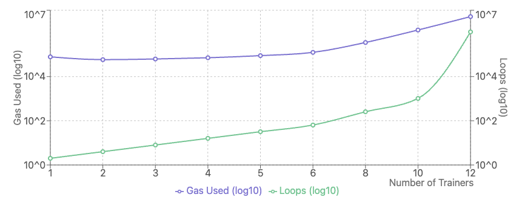
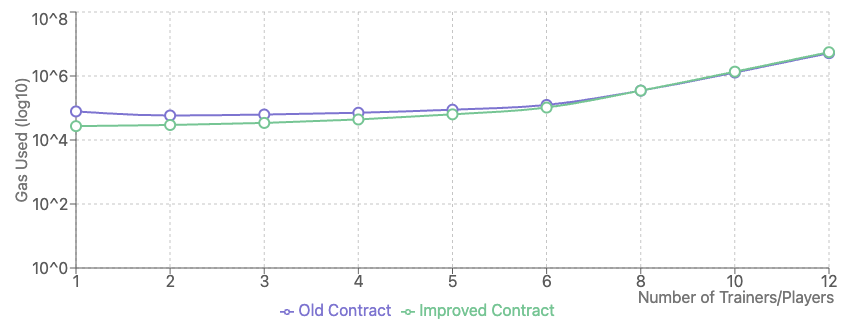
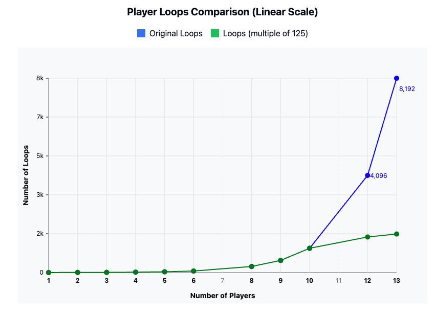
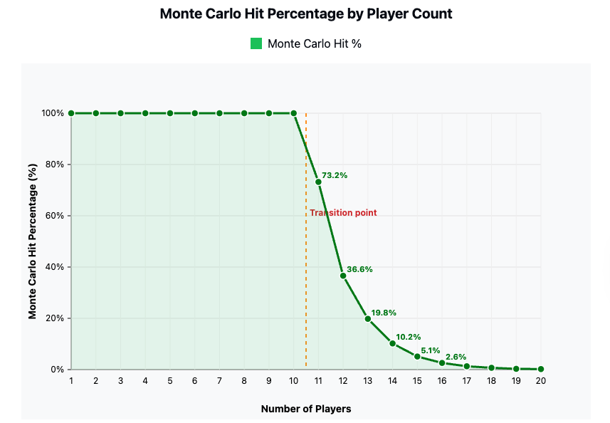
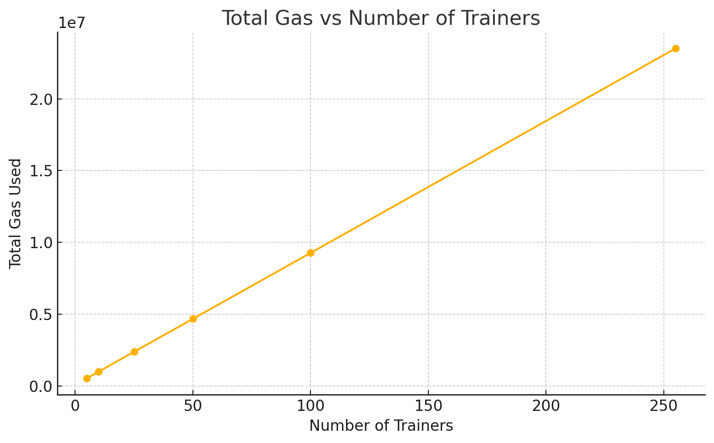
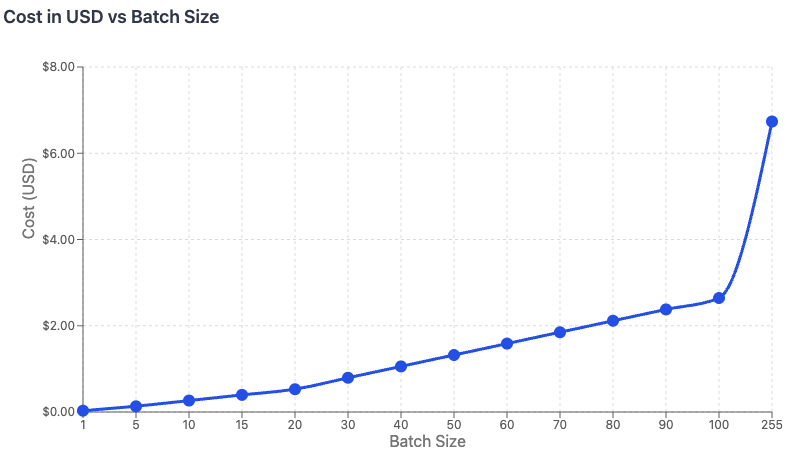
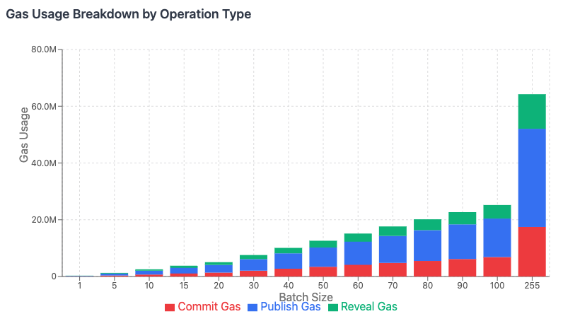
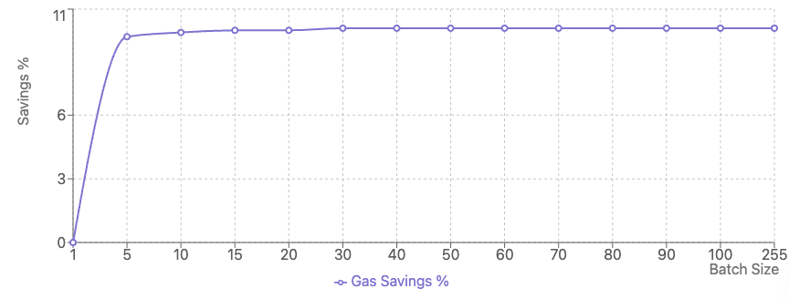

# Gas Analysis Report: ImprovedPrivateShapley Contract

## Configuration

- Gas Price: 30 gwei
- Polygon Price: $0.18 USD

## Table of Contents

1. [Scaling Analysis](#scaling-analysis)
2. [Batch Operation Analysis](#batch-operation-analysis)
3. [Complete Workflow Analysis](#complete-workflow-analysis)
4. [Shapley Calculation Analysis](#shapley-calculation-analysis)
5. [Storage Optimization Analysis](#storage-optimization-analysis)
6. [Edge Case Analysis](#edge-case-analysis)
7. [Cost Summary](#cost-summary)
8. [Optimization Recommendations](#optimization-recommendations)

---

## Scaling Analysis

### Claim rewards Cost(testClaimRewardsGasScaling):

#### Old contract

| Trainers | Gas Used  | 2^n loops | Cost (USD) |
| -------- | --------- | --------- | ---------- |
| 1        | 78,152    | 2         | $0.00042   |
| 2        | 58,290    | 4         | $0.00031   |
| 3        | 62,468    | 8         | $0.00034   |
| 4        | 71,028    | 16        | $0.00038   |
| 5        | 88,556    | 32        | $0.00048   |
| 6        | 124,428   | 64        | $0.00067   |
| 8        | 347,820   | 256       | $0.00188   |
| 10       | 1,280,556 | 1,024     | $0.00692   |
| 12       | 5,168,172 | 1,048,576 | $0.02791   |

#### Improved Contract

| Players | Gas Used   | Gas/Player | 2^n loops | Cost (USD) |
| ------- | ---------- | ---------- | --------- | ---------- |
| 1       | 27,133     | 27,133     | 2         | $0.00015   |
| 2       | 29,454     | 14,727     | 4         | $0.00016   |
| 3       | 34,180     | 11,393     | 8         | $0.00019   |
| 4       | 43,800     | 10,950     | 16        | $0.00024   |
| 5       | 63,376     | 12,675     | 32        | $0.00035   |
| 6       | 103,200    | 17,200     | 64        | $0.00057   |
| 8       | 348,864    | 43,608     | 256       | $0.00192   |
| 9       | 683,584    | 75,953     | 512       | $0.00376   |
| 10      | 1,363,776  | 136,377    | 1,024     | $0.00750   |
| 12      | 5,552,448  | 462,704    | 4,096     | $0.03054   |
| 13      | 11,252,032 | 865,540    | 8,192     | $0.06190   |

_Cost calculated at 30 gwei gas price and $0.18 per MATIC (Polygon)._

#### Monte Contract

| Players | original loops | Loops (multiple of 125) |
| ------- | -------------- | ----------------------- |
| 1       | 2              | 2                       |
| 2       | 4              | 4                       |
| 3       | 8              | 8                       |
| 4       | 16             | 16                      |
| 5       | 32             | 32                      |
| 6       | 64             | 64                      |
| 8       | 256            | 256                     |
| 9       | 512            | 512                     |
| 10      | 1,024          | 1024                    |
| 12      | 4,096          | 1,500                   |
| 13      | 8,192          | 1,625                   |
| 65      | -              | 8125                    |

Hit % ratio:

| Players | Monte Carlo Hit % |
| ------- | ----------------- |
| 1       | 100               |
| 2       | 100               |
| 3       | 100               |
| 4       | 100               |
| 5       | 100               |
| 6       | 100               |
| 7       | 100               |
| 8       | 100               |
| 9       | 100               |
| 10      | 100               |
| 11      | 73.2%             |
| 12      | 36.6%             |
| 13      | 19.8%             |
| 14      | 10.2%             |
| 15      | 5.1%              |
| 16      | 2.6%              |
| 17      | 1.3%              |
| 18      | 0.7%              |
| 19      | 0.3%              |
| 20      | 0.2%              |

### Trainer Count Scaling

This analysis shows how gas consumption scales with the number of trainers in the system.

| Trainers | SetTrainers | CommitMap | RevealMap  | Avg/Trainer | Total Gas  | Cost (USD) |
| -------- | ----------- | --------- | ---------- | ----------- | ---------- | ---------- |
| 5        | 123,937     | 24,756    | 385,616    | 106,861     | 534,309    | $0.00289   |
| 10       | 246,002     | 24,756    | 723,117    | 99,387      | 993,875    | $0.00537   |
| 25       | 612,197     | 24,756    | 1,735,622  | 94,903      | 2,372,575  | $0.01281   |
| 50       | 1,222,522   | 24,756    | 3,423,137  | 93,408      | 4,670,415  | $0.02522   |
| 100      | 2,443,172   | 24,756    | 6,798,198  | 92,661      | 9,266,126  | $0.05004   |
| 255      | 6,227,187   | 24,756    | 17,261,136 | 92,208      | 23,513,079 | $0.12704   |

It shows that scaling doesn't affect the cost but made sure that we can set 256 trainers at once at a minimal cost

### Coalition Batch Scaling

This analysis shows how gas consumption scales with coalition size.

| Batch Size | Commit Gas | Publish Gas | Reveal Gas | Total Gas  | Cost (USD) | Avg/Item | Saving % |
| ---------- | ---------- | ----------- | ---------- | ---------- | ---------- | -------- | -------- |
| 1          | 70,398     | 137,533     | 72,465     | 280,396    | $0.0294    | 280,396  | 0%       |
| 5          | 344,130    | 680,497     | 241,530    | 1,266,157  | $0.1327    | 253,231  | 9.7%     |
| 10         | 686,295    | 1,359,202   | 480,362    | 2,525,859  | $0.2648    | 252,586  | 9.9%     |
| 15         | 1,028,460  | 2,037,907   | 719,194    | 3,785,561  | $0.3967    | 252,371  | 10.0%    |
| 20         | 1,370,625  | 2,716,612   | 958,028    | 5,045,265  | $0.5287    | 252,263  | 10.0%    |
| 30         | 2,054,955  | 4,074,022   | 1,435,698  | 7,564,675  | $0.7930    | 252,156  | 10.1%    |
| 40         | 2,739,285  | 5,431,432   | 1,913,372  | 10,084,089 | $1.0573    | 252,102  | 10.1%    |
| 50         | 3,423,615  | 6,788,842   | 2,391,049  | 12,603,506 | $1.3216    | 252,070  | 10.1%    |
| 60         | 4,107,945  | 8,146,252   | 2,868,729  | 15,122,926 | $1.5859    | 252,049  | 10.1%    |
| 70         | 4,792,275  | 9,503,662   | 3,346,413  | 17,642,350 | $1.8502    | 252,033  | 10.1%    |
| 80         | 5,476,605  | 10,861,072  | 3,824,101  | 20,161,778 | $2.1145    | 252,022  | 10.1%    |
| 90         | 6,160,935  | 12,218,482  | 4,301,792  | 22,681,209 | $2.3788    | 252,013  | 10.1%    |
| 100        | 6,845,265  | 13,575,892  | 4,779,486  | 25,200,643 | $2.6431    | 252,006  | 10.1%    |
| 255        | 17,452,380 | 34,615,747  | 12,184,202 | 64,252,329 | $6.7355    | 251,970  | 10.1%    |

## Storage Optimization Analysis

| Pattern                              | Gas Cost | USD      |
| ------------------------------------ | -------- | -------- |
| Minimal coalition commit             | 71,829   | $0.00039 |
| Publish first tester result          | 95,910   | $0.00052 |
| Second tester publish (array growth) | 53,580   | $0.00029 |
| Third tester publish                 | 55,149   | $0.00030 |

**Take-away:** Storing the running `sumScores`/`numScores` (instead of appending to an array every time) is already very lean; gas per extra tester result stays below **$0.0006**.

## Cost Summary

### Operation Cost Breakdown

### Operation Cost Breakdown (Polygon main-net)

| Actor   | Typical Operation (50-trainer round)                         | Gas Range     | USD Range         | Notes                     |
| ------- | ------------------------------------------------------------ | ------------- | ----------------- | ------------------------- |
| Owner   | Initial setup – set trainers + mapping reveal + Shapley seed | 4.6M – 5.2M   | $0.025 – $0.028   | once per round            |
| Owner   | Commit coalition batch (≈20 ids)                             | 1.3M – 1.4M   | $0.007 – $0.008   | 2–5× per round            |
| Owner   | Reveal same batch                                            | 0.9M – 1.0M   | $0.005 – $0.006   | 2–5× per round            |
| Tester  | Publish results (batch 10)                                   | 0.25M – 0.35M | $0.0014 – $0.0019 | each tester, many batches |
| Trainer | Claim rewards (batch 10 coalitions)                          | 0.20M – 0.30M | $0.0011 – $0.0016 | once per round            |

> **Perspective:** Every listed action costs fractions of a cent; even the owner’s heaviest one-off setup comes in under three cents.

### Monthly Cost Projections

| Role         | Daily Actions (avg)                     | Daily Cost | Monthly Cost |
| ------------ | --------------------------------------- | ---------- | ------------ |
| Owner        | 1 round setup + 5 commit+reveal batches | $0.05      | $1.50        |
| Tester (×1)  | 20 result batches                       | $0.04      | $1.20        |
| Trainer (×1) | 2 reward-claim batches                  | $0.003     | $0.09        |

## Optimization Recommendations

### 1. Batch Size Optimization

| Operation                      | Optimal Batch size       | Why it matters                                                  |
| ------------------------------ | ------------------------ | --------------------------------------------------------------- |
| **Commit / reveal coalitions** | **15 – 20 items**        | 10 %+ gas saved per coalition without hitting block-gas limits  |
| **Result publishing**          | **10 – 20 items**        | Keeps calldata small; testers still get fast feedback           |
| **Reward claiming (trainers)** | **≥ 10 coalitions < 12** | Amortises fixed Shapley cost; \~90 % cheaper than single claims |

### 2. Shapley Value Constraints

| Player Count     | Recommendation | Notes                                 |
| ---------------- | -------------- | ------------------------------------- |
| **≤ 12 players** | Safe on-chain  | Gas grows ≈ 2ⁿ, but remains practical |
| **> 13 **        | Not feasible   | Gas Cost exceed total block size      |

### 3. Storage Optimization

TODO

### 6. Architectural Improvements

1. **Lazy Shapley calculation**: Calculate only when claiming, not storing all values
2. **Merkle tree commitments**: For very large trainer sets (>100)
3. **Layer 2 deployment**: Consider Arbitrum/Optimism for 10-100x cost reduction
4. **Hybrid model**: critical state on-chain, heavy maths (Shapley > 15) done off-chain with on-chain attestation.

## Conclusion

**Key Takeaways: ImprovedPrivateShapley Gas Efficiency**

- **Cent-level cost on Polygon** for:
  - **≤ 50 trainers per round**
  - **≤ 12 players in any Shapley calculation**
  - **Batched operations of 10–20 items**

**Best Practices for Scaling:**

- **Batch aggressively** to amortize fixed costs.
- **Stay within the 15-player Shapley window** for predictable gas.
- **Minimize storage writes** wherever possible.

> For very large federations (**> 100 trainers** or **> 20 Shapley players**):  
> Move heavy math off-chain or to a Layer 2, and anchor only proofs on mainnet.
